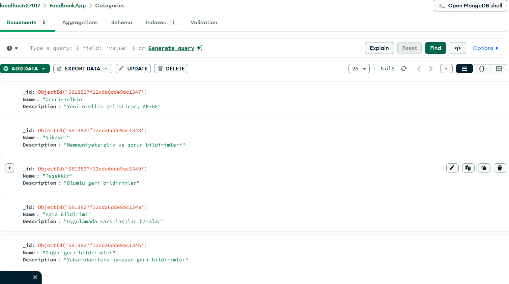
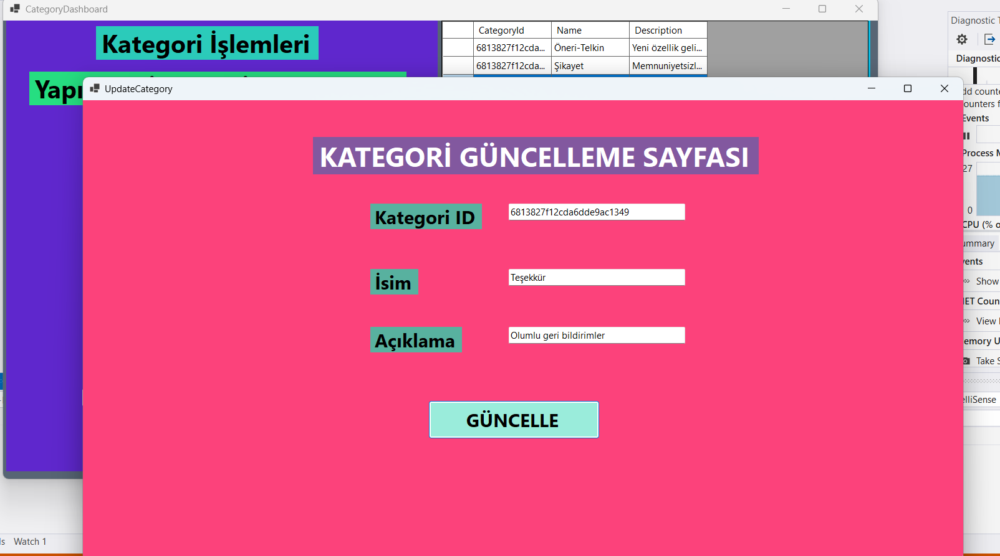
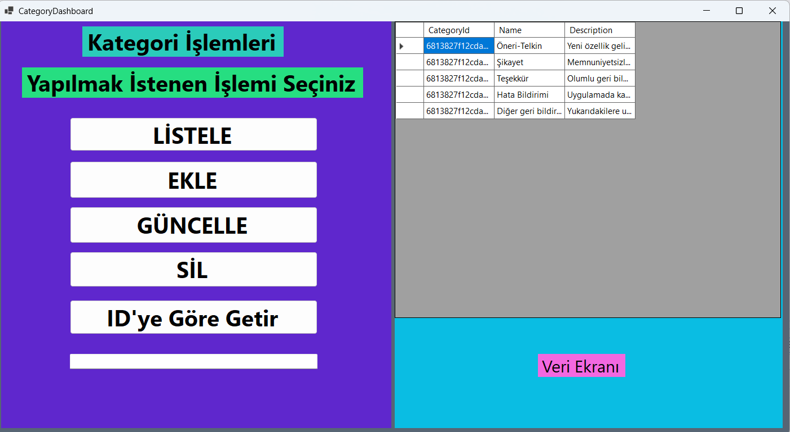

# 🚀 FeedbackApp

**FeedbackApp**, basit bir C# Windows Forms uygulamasıdır.  
Bu proje ile `MongoDB` veritabanı bağlantısı, `DTO` kullanımı ve `Windows Forms` arayüzü üzerinden CRUD işlemlerini nasıl yöneteceğinizi örnekledim.

> **Amacı**: Kod tekrarını azaltmak, basit veri taşıma mantığını pekiştirmek. Gerçek bir son kullanıcı ürünü değildir.

---

## ⚙️ Kullanılan Teknolojiler

- **C#**
- **Windows Forms**
- **MongoDB.Driver**
- **DTO (Data Transfer Object) Yapısı**

---

## 📌 Proje Özellikleri

1. ✅ Kullanıcı ekleme  
2. ✅ Kullanıcı listeleme (DataGridView)  
3. ✅ Kullanıcı güncelleme (Formlar arası parametre/property ile veri taşıma)  
4. ✅ Kullanıcı silme  
5. ✅ MongoDB üzerinde `_id` filtreleme ve immutable alan yönetimi

---

## 📝 Neden Bu Proje?

- ***Amaç***: Basit CRUD akışını tekrar tekrar yazmak yerine, bir iskelet proje olarak kullanmak.
- ***Kimler İçin?***: Kendi projelerinde MongoDB + WinForms + DTO kombinasyonunu denemek isteyen   geliştiriciler için örnek olabilir.
- ***Not***: Production (canlı) ortam için optimize edilmemiştir.

---

##  🚧 Ekran Görüntüleri

